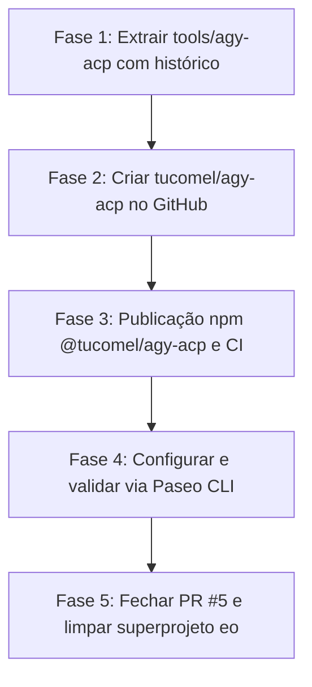

# Plano — Extração do `agy-acp` e Integração Oficial com o Paseo (Server & CLI Docs)

**Data:** 2026-09-04 15:32 (America/Sao_Paulo)  
**Workspace:** `entregadoronline/eo` (Superprojeto)  
**Layer:** `layer32` (`WS_LAYER` em `eows/eows/appsettings.json`)  
**Arquivo:** `.plan/20260904-1532+layer32+extracao-agy-acp-alinhado-paseo-docs.md`  
**Referência Oficial:** [Paseo Docs — Server & CLI, Custom Providers e Plugins](https://paseo.sh/docs#server--cli)

---

## 1. Fundamentação Técnica com Base na Documentação Oficial do Paseo

Conforme documentado em [paseo.sh/docs/custom-providers](https://paseo.sh/docs/custom-providers), [paseo.sh/docs/cli](https://paseo.sh/docs/cli) e inspecionado no código do `@getpaseo/cli` e `@getpaseo/server`:

### 1.1. Ciclo de Vida do Daemon e Provedores Customizados
1. **Configuração Unificada (`~/.paseo/config.json`)**:
   Provedores adicionais ou de terceiros vivem sob `agents.providers.<id>`:
   ```json
   {
     "agents": {
       "providers": {
         "antigravity": {
           "extends": "acp",
           "label": "Antigravity",
           "command": ["npx", "-y", "@tucomel/agy-acp", "--acp"],
           "enabled": true
         }
       }
     }
   }
   ```
2. **`paseo reload` (sem reiniciar o processo do Daemon)**:
   - A documentação oficial estabelece:
     > *"Run `paseo reload` after editing the file. Provider changes apply to future launches without restarting the daemon."*
   - O comando `paseo reload` (ou `paseo daemon reload`) valida o arquivo, atualiza a árvore de provedores em memória e aplica alterações runtime-safe sem reiniciar o processo nem derrubar conexões WebSocket.
   - Provedores ACP são executados como processos efêmeros sob demanda (`stdio`), logo alterações no comando se aplicam automaticamente aos novos lançamentos de agentes.
3. **Diagnóstico Oficial (`paseo provider diagnostic <id>`)**:
   - A CLI expõe `paseo provider diagnostic antigravity`, que valida:
     - Resolução do executável e `PATH` do daemon.
     - Handshake `initialize` via JSON-RPC.
     - Modelos e modos retornados pelo adapter.
4. **Execução Direta pela CLI**:
   - `paseo run --provider antigravity "minha tarefa"` inicia um agente diretamente pelo terminal, validando a integração fim a fim.

---

## 2. Decisão Arquitetural e Fechamento do PR #5

- O **PR #5** tentava contornar a questão de downtime com mais de 1.000 linhas de shell scripts embutidos no monorepo (`deploy-safety.lock`, `route.lock`, journals duráveis em JSON e 9 workflows de CI).
- Como demonstrado, no commit `cb177a9` o script principal foi acidentalmente sobrescrito e os CIs estão em deadlock de 50 minutos.
- O Paseo foi projetado para consumir provedores externos como executáveis isolados (pacotes npm via `npx`, binários no `PATH` ou comandos customizados).
- **Decisão:** Fechar o PR #5 e desacoplar o `agy-acp` completamente do repositório de produto `eo`.

---

## 3. Fases do Plano de Execução



### Fase 1: Extração com Preservação de Histórico Git
1. Gerar uma branch independente apenas com o histórico do diretório `tools/agy-acp`:
   ```bash
   git subtree split -P tools/agy-acp -b agy-acp-standalone
   ```
2. Reorganizar a estrutura raiz no novo repositório:
   - `package.json` na raiz com escopo `@tucomel/agy-acp`.
   - `bin: { "agy-acp": "./dist/index.js" }`.
   - `src/` e `tests/` na raiz.
   - `README.md` com instruções canônicas de configuração para Paseo, Zed e Claude Code.

### Fase 2: Criação do Repositório Remoto `tucomel/agy-acp`
1. Criar o repositório público no GitHub:
   ```bash
   gh repo create tucomel/agy-acp --public --description "ACP (Agent Client Protocol) provider for Google Antigravity in Paseo and Zed"
   ```
2. Realizar push do histórico isolado para a branch `main`.

### Fase 3: Pipeline de CI/CD e Publicação (npm / Releases)
1. Configurar GitHub Actions (`.github/workflows/ci.yml`):
   - Typecheck, testes unitários com Vitest (Node.js 20 e 22).
   - Teste automatizado do handshake `initialize` do protocolo ACP.
2. Configurar workflow de release (`.github/workflows/release.yml`):
   - Publicação automática no npm (`npm publish --access public`) quando gerada uma tag semver (`v*`).

### Fase 4: Integração Local no Paseo via Comandos Canônicos da CLI
1. No arquivo `~/.paseo/config.json`:
   - Configurar o provider `antigravity` para usar o executável do `@tucomel/agy-acp`.
2. Executar os comandos oficiais do Paseo:
   ```bash
   paseo reload
   paseo provider ls
   paseo provider diagnostic antigravity
   paseo provider models antigravity
   ```
3. Testar a execução de um agente via CLI:
   ```bash
   paseo run --provider antigravity --model gemini-3.8-flash "echo hello"
   ```

### Fase 5: Limpeza do Monorepo `entregadoronline/eo`
1. Fechar o PR #5 no GitHub com justificativa de arquitetura e link para o novo repositório.
2. Remover a branch remota `feat/agy-acp-zero-downtime-v2`.
3. Remover do repositório `eo`:
   - `tools/agy-acp/`
   - `bin/agy-acp`
   - `.github/workflows/agy-acp.yml`
   - `.github/workflows/deploy-agy-acp.yml`
4. Commit limpo e preservação estrita do foco do monorepo em `eoapp` e `eows`.

---

## 4. Plano de Verificação

### Testes no Pacote Standalone (`tucomel/agy-acp`)
- `npm run build` gera a distribuição em `dist/`.
- `npm test` passa 100% dos testes unitários de store, schema e catálogo.
- Smoke test via stdin/stdout:
  ```bash
  printf '{"jsonrpc":"2.0","id":1,"method":"initialize","params":{"protocolVersion":1,"clientCapabilities":{}}}\n' | node dist/index.js
  ```

### Testes de Integração com o Paseo Server & CLI
- `paseo reload`: saída deve reportar `appliedPaths: ["agents.providers.antigravity"]` sem solicitar restart do daemon.
- `paseo provider diagnostic antigravity`: status deve ser `available`.
- `paseo run --provider antigravity`: deve iniciar e completar uma tarefa com streaming e persistência de sessão.
