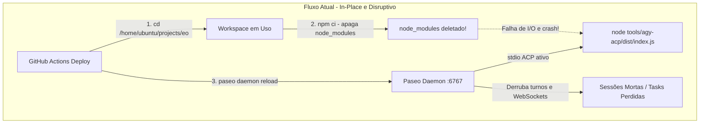

# Plano de Implementação — Zero-Downtime Continuous Delivery (Paseo + Antigravity ACP)

**Data:** 2026-09-03 20:01 (America/Sao_Paulo)  
**Workspace:** `entregadoronline/eo` (Superprojeto)  
**Layer:** `layer32` (`WS_LAYER` em `eows/eows/appsettings.json`)  
**Arquivo:** `.plan/20260903-2001+layer32+zero-downtime-deploy-paseo-acp.md`  

---

## 1. Descrição do Problema e Contexto

Atualmente, quando o workflow de deploy (`.github/workflows/deploy-agy-acp.yml`) é executado:
1. **Compilação in-place no workspace ativo**: O runner entra em `/home/ubuntu/projects/eo/tools/agy-acp` e executa `npm ci --no-audit --no-fund` seguido de `npm run build`.
   - O comando `npm ci` deleta a pasta `node_modules` inteira do disco antes de reinstalar.
   - Qualquer processo do `agy-acp` em execução naquele momento perde o acesso aos módulos importados, gerando erros de `MODULE_NOT_FOUND` ou corrupção de runtime.
   - O `dist/index.js` é sobrescrito enquanto o runtime do Node.js está lendo os arquivos.
2. **Interrupção de sessões ativas (stdio fechado)**: Como o Paseo se comunica com o adapter via stdin/stdout (`stdio`), se o processo do adapter quebra ou recebe `SIGTERM`/`EOF`, o Paseo marca a sessão do agente como `crashed` / `closed` (`requiresAttention: true`). Qualquer tarefa em andamento pelo bot é abortada e perdida.
3. **`paseo daemon reload` e reinicialização**: O workflow disparava `paseo daemon reload`, recriando todos os clientes de provedores e descartando conexões WebSocket ativas entre o frontend (`app.paseo.sh`) e o daemon local.

### Objetivo
Construir uma arquitetura de **Continuous Delivery com Zero Downtime**, onde:
- Novos deploys sejam **atômicos**, **idempotentes** e **isolados** (Blue-Green de binários / releases imutáveis).
- Sessões em andamento continuem executando até o fim em sua versão de binário sem qualquer interrupção.
- Novas sessões e turns passem a usar a nova versão instantaneamente.
- O deploy seja acionado periodicamente por um **cron de 1 hora** (com checagem de alteração de commit), mantendo `workflow_dispatch` manual.
- O Paseo **nunca seja derrubado** durante o ciclo rotineiro de atualização de adapters.
- Definir também a arquitetura de **Socket Handoff / Dual Daemon** caso no futuro o próprio binário do Paseo Daemon precise ser atualizado em produção.

---

## 2. Diagnóstico da Arquitetura Atual



### Por que o Paseo caiu nas execuções anteriores?
1. O comando do provider em `/home/ubuntu/.paseo/config.json` apontava diretamente para o diretório de desenvolvimento: `["/home/ubuntu/projects/eo/bin/agy-acp"]`.
2. O script `/home/ubuntu/projects/eo/bin/agy-acp` tenta verificar `find src -newer dist` e recompilar `npm run build` na hora da execução.
3. Quando o runner do GitHub Actions roda `npm ci`, ele remove a árvore de dependências do workspace enquanto sessões do Paseo tentam invocar o binário.

---

## 3. Arquitetura Proposta: Continuous Delivery com Zero Downtime

```mermaid
graph TD
    subgraph Releases [Diretório de Releases Imutáveis: ~/.local/opt/agy-acp]
        R1[releases/1.1.0-commitA<br/>Sessões antigas em execução...]
        R2[releases/1.1.0-commitB<br/>Build novo testado e aprovado]
        CurrentLink[current ---> releases/1.1.0-commitB]
    end

    subgraph Runtime [Execução Transparente]
        PaseoBin[/home/ubuntu/.local/bin/agy-acp] --> CurrentLink
        PaseoDaemon[Paseo Daemon :6767<br/>NUNCA reinicia] -->|Novas sessões| CurrentLink
        PaseoDaemon -.->|Sessões ativas continuam aqui| R1
    end

    Cron[Cron 1x por hora] -->|Verifica se há novos commits| BuildStage[Build Isolado em /tmp]
    BuildStage -->|Smoke Test OK| R2
    R2 -->|Atomic Symlink Swap ln -sfn| CurrentLink
```

### 3.1. Nível 1: Blue-Green Atômico do Adaptador (`agy-acp`)
1. **Diretório de Releases Imutáveis**:
   - `~/.local/opt/agy-acp/releases/<release-id>`: cada versão compilada reside em seu próprio diretório isolado contendo seu próprio `node_modules` de produção e seu `dist/`.
   - `~/.local/opt/agy-acp/current`: symlink atômico apontando para a release ativa.
   - `~/.local/bin/agy-acp`: wrapper leve e executável padrão no `PATH`.
2. **Build Fora de Banda (Out-of-Band Staging)**:
   - O runner constrói em um diretório temporário (`~/.local/opt/agy-acp/staging/<sha>`).
   - Executa `npm ci` e `npm run build` sem encostar no workspace `/home/ubuntu/projects/eo` nem na release atual.
   - Executa **Smoke Test**: `dist/index.js --help` e `dist/index.js --version --json`.
3. **Troca Atômica de Symlink (Zero Downtime Swap)**:
   - Quando aprovado, move para `releases/<sha>`.
   - Executa `ln -sfn releases/<sha> ~/.local/opt/agy-acp/current`. No Linux (POSIX), a substituição de symlink com `ln -sfn` é atômica no nível de filesystem.
4. **Isolamento de Processos Antigos**:
   - Processos já instanciados continuam com seus *file descriptors* abertos para os arquivos da release antiga até que o turno termine.
   - Novas sessões e novos processos abrem imediatamente o novo binário a partir do symlink `current`.
5. **Configuração do Paseo**:
   - No `/home/ubuntu/.paseo/config.json`, o comando do provider passa a ser:
     `"command": ["/home/ubuntu/.local/bin/agy-acp"]`
   - **Nenhum `paseo daemon reload` é necessário**. O Paseo executa o binário por sessão, logo ele herda a nova release sem precisar reiniciar seu processo nem derrubar conexões WebSocket.
6. **Limpeza de Releases Órfãs (Pruning)**:
   - Mantém as últimas 3 releases.
   - Antes de remover releases antigas, o script verifica via `lsof` ou `/proc/*/fd` se algum processo de agente ativo ainda está usando aquele diretório. Se estiver, a remoção é postergada.

---

### 3.2. Nível 2: Arquitetura de Socket Handoff / Dual Daemon (Paseo Daemon)
Para cenários futuros onde o próprio Paseo Daemon precise ser atualizado (`@getpaseo/cli`):

1. **Topologia de Portas**:
   - **Porta Pública (Exposta)**: `127.0.0.1:6767` gerenciada por um proxy leve de handoff (ou socket forwarding).
   - **Paseo Blue (Ativo)**: rodando em `127.0.0.1:6768`.
   - **Paseo Green (Novo)**: sobe em `127.0.0.1:6769`.
2. **Sequência de Handoff**:
   - O novo daemon (Green) inicia e executa seu self-check (`paseo daemon status`).
   - O proxy de porta passa a rotear novas requisições e novas conexões WebSocket para o Green.
   - O Blue entra em estado **Draining** (Graceful Drain): não aceita novas sessões, mas mantém as conexões existentes até que as sessões ativas finalizem suas tarefas.
   - Quando o Blue zerar as conexões ativas (ou após timeout de segurança), ele é finalizado.

> [!NOTE]
> Para o ciclo de desenvolvimento diário e deploys de código da equipe, **apenas o Nível 1 é necessário**, pois 100% das alterações de código residem no repositório `eo` (`tools/agy-acp`), enquanto o Paseo é apenas o cliente consumidor do protocolo ACP.

---

## 4. Mudanças Propostas

### Componente 1: Script de Deploy Atômico (`bin/deploy-agy-acp`)
Criar um script idempotente e seguro para realizar o build isolado, verificação e swap atômico.

#### [NEW] `bin/deploy-agy-acp`
- Cria staging em `~/.local/opt/agy-acp/staging/<sha>`.
- Copia fontes de `tools/agy-acp`.
- Roda `npm ci --no-audit --no-fund` e `npm run build`.
- Roda verificação (`--version --json`).
- Promove para `~/.local/opt/agy-acp/releases/<sha>`.
- Troca symlink atômico `~/.local/opt/agy-acp/current`.
- Garante symlink `~/.local/bin/agy-acp`.
- Faz prune de versões antigas sem derrubar processos em execução.

---

### Componente 2: Atualização do Workflow do GitHub Actions
Ajustar o workflow [.github/workflows/deploy-agy-acp.yml](file:///home/ubuntu/projects/eo/.github/workflows/deploy-agy-acp.yml).

#### [MODIFY] `.github/workflows/deploy-agy-acp.yml`
- **Gatilhos**:
  - `schedule: - cron: '0 * * * *'` (executa 1x por hora).
  - `workflow_dispatch:` (acionamento manual a qualquer momento pelo GitHub Actions ou CLI).
- **Passo de Verificação de Mudanças**:
  - Compara o último commit instalado (`~/.local/bin/agy-acp --version --json`) com `origin/master`.
  - Se não houver novos commits em `tools/agy-acp/**`, o job encerra com sucesso em 2 segundos.
- **Passo de Deploy**:
  - Executa `bin/deploy-agy-acp`.
  - **Remove** a chamada disruptiva `paseo daemon reload`.
  - **Remove** modificações destrutivas dentro de `/home/ubuntu/projects/eo/tools/agy-acp`.

---

### Componente 3: Configuração do Paseo
Atualizar o arquivo de configuração do Paseo para consumir o binário estável via symlink.

#### [MODIFY] `/home/ubuntu/.paseo/config.json`
- Alterar o comando do provider `antigravity`:
  ```json
  "command": [
    "/home/ubuntu/.local/bin/agy-acp"
  ]
  ```

---

## 5. Plano de Verificação

### Testes Automatizados
1. **Teste do script de build e swap atômico**:
   ```bash
   bash bin/deploy-agy-acp --dry-run
   bash bin/deploy-agy-acp
   ```
2. **Verificação de integridade do binário deployado**:
   ```bash
   /home/ubuntu/.local/bin/agy-acp --version --json
   /home/ubuntu/.local/bin/agy-acp --help
   ```
3. **Simulação de Concorrência e Zero-Downtime**:
   - Iniciar um processo simulado mantendo uma conexão ativa com o binário antigo.
   - Disparar o deploy de uma nova versão.
   - Confirmar que o processo antigo continua vivo, lendo seus módulos e respondendo normalmente.
   - Confirmar que qualquer nova chamada a `/home/ubuntu/.local/bin/agy-acp` já abre o novo binário.
   - Confirmar que o Paseo Daemon permanece no mesmo PID (`83186`), sem desconexão de WebSocket no frontend.

### Verificação Manual com o Usuário
- Enviar uma mensagem para um agente no Paseo (`app.paseo.sh`).
- Disparar o deploy via `gh workflow run deploy-agy-acp.yml`.
- Observar que o chat do agente não para, não dá timeout e não morre.
- Abrir uma nova aba ou novo agente e verificar que a versão reportada já reflete o novo commit.

---

## 6. Revisão do Usuário Necessária

> [!IMPORTANT]
> - O Paseo passará a invocar `/home/ubuntu/.local/bin/agy-acp` em vez de compilar sob demanda em `/home/ubuntu/projects/eo/tools/agy-acp`.
> - O workspace `/home/ubuntu/projects/eo` nunca mais será tocado por rotinas de deploy automático, garantindo total integridade do seu ambiente de trabalho local.
> - O cron de deploy rodará de hora em hora (`0 * * * *`), e o botão manual `workflow_dispatch` continuará disponível para quando você quiser aplicar imediatamente.
